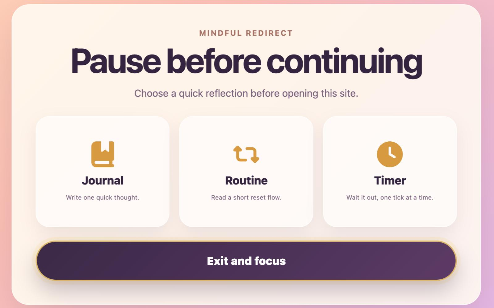
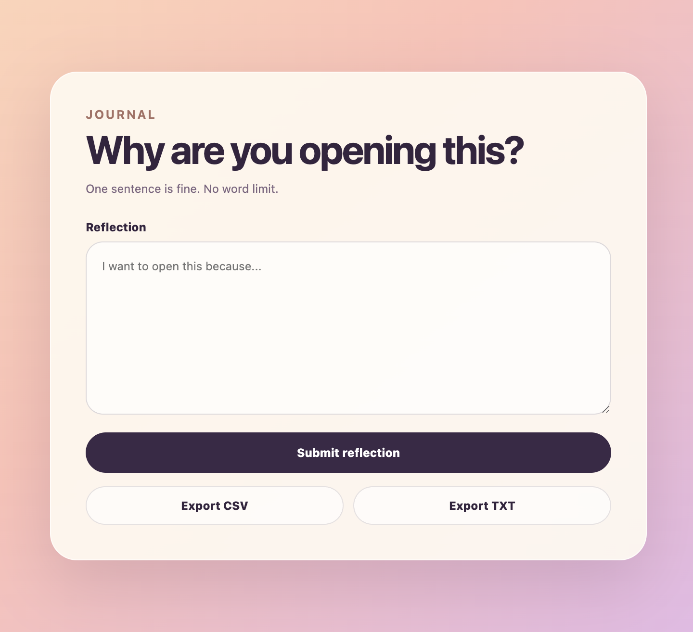
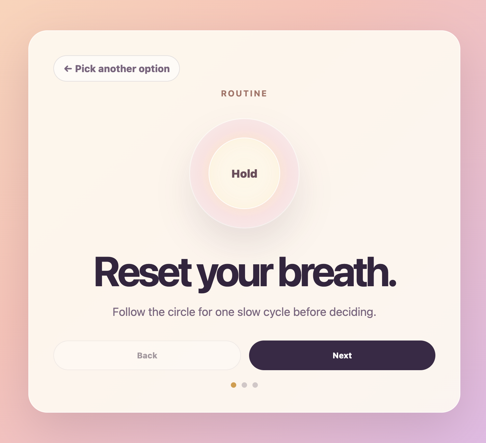
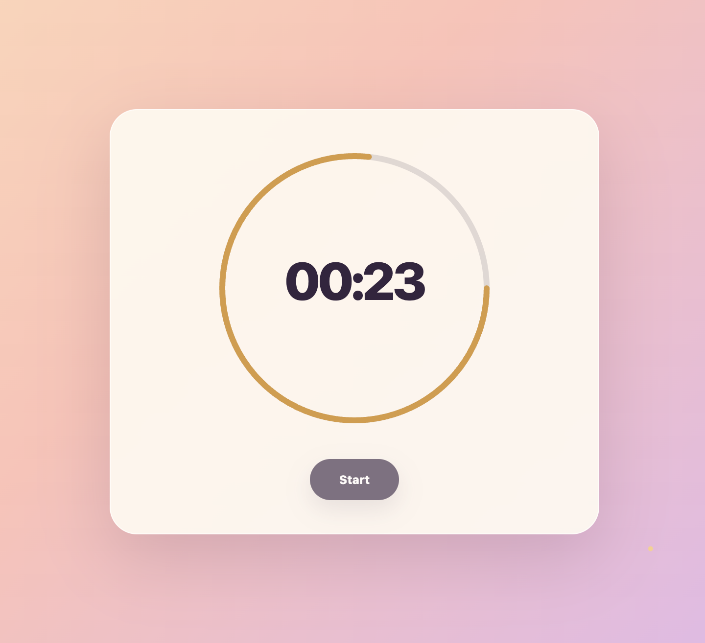

# Mindful Redirect

A Chrome extension that redirects specified websites onto a mindfulness page, where you can choose to journal, complete a breathing routine, wait through a reflection timer, or exit and focus.

## Installation

1. Navigate to the [Chrome Web Store Page](https://chromewebstore.google.com/detail/mindful-redirect/eaamioafeknhkapchlceggfdcombeoal)
2. Click **Add to Chrome**
3. Click on the Chrome Extension icon to customize blocked websites, timer length, routine message, and unblock duration.

## Extension Page Images

| Home | Journal |
| :---: | :---: |
|  |  |

| Routine | Timer |
| :---: | :---: |
|  |  |

## Customization Options

- 🧑‍💻 Blocked sites
- ⏳ Reflection timer length
- 💬 Custom message displayed within the mindfulness routine
- ⏰ Unblock expiration duration